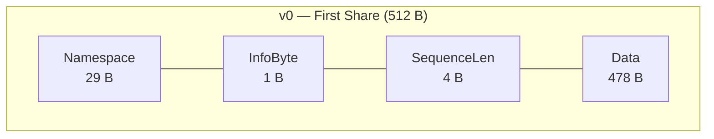
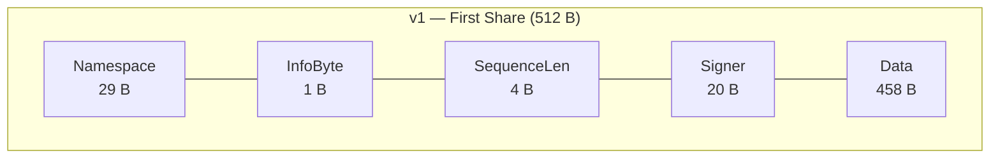
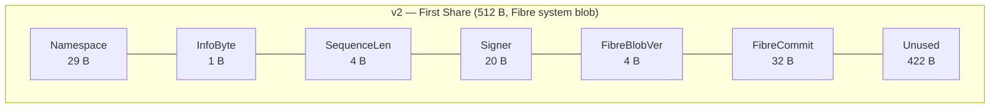
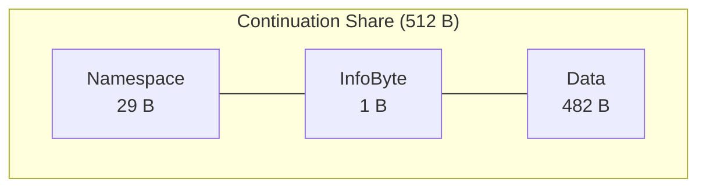
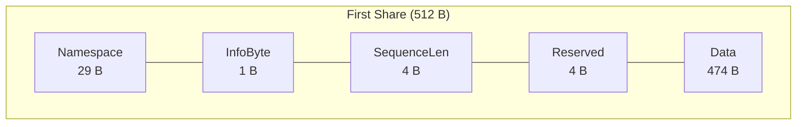
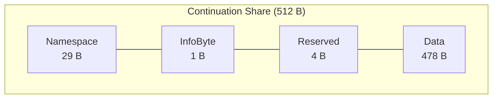
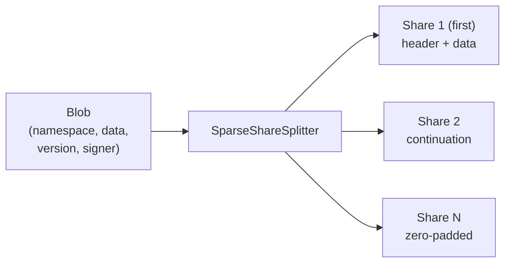
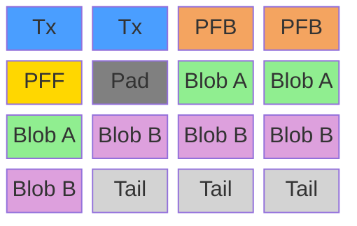
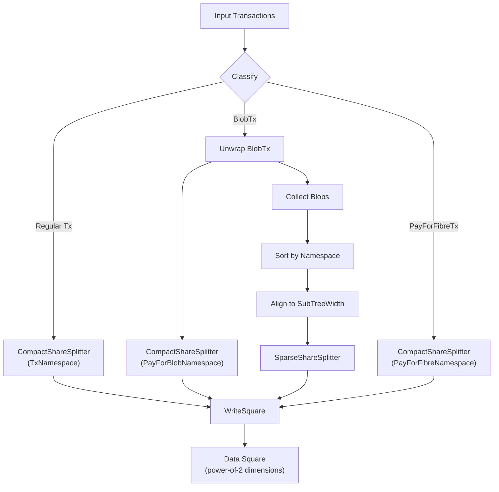
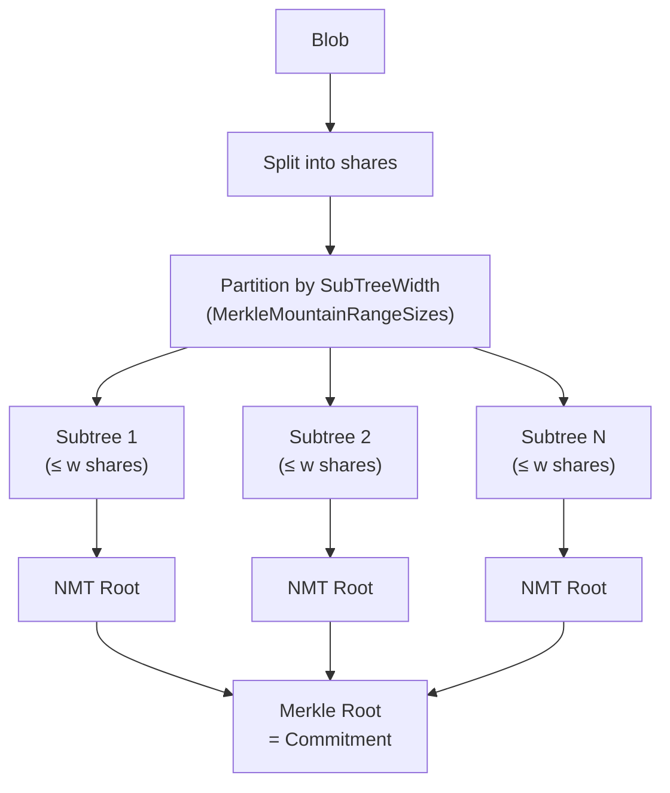

# go-square

[](https://pkg.go.dev/github.com/celestiaorg/go-square/v4)

`go-square` is a Go module that provides data structures and utilities for interacting with data squares in the Celestia network. The data square is a special form of block serialization in the Celestia blockchain designed for sampling. This repo deals with the original data square which is distinct from the extended data square. Operations on the extended data square are handled by [rsmt2d](https://github.com/celestiaorg/rsmt2d).

Package   | Description
----------|---------------------------------------------------------------------------------------------------------------------
inclusion | Package inclusion contains functions to generate the blob share commitment from a given blob.
proto     | Package contains proto definitions and go generated code
share     | Package share contains encoding and decoding logic from blobs to shares.
square    | Package square implements the logic to construct the original data square based on a list of transactions.
tx        | Package tx contains BlobTx, FibreTx, and IndexWrapper types

## Architecture

### Share Layout

A share is the atomic unit of data in Celestia, fixed at **512 bytes**. There are two types:

- **Compact shares** pack transactions. Multiple transactions are concatenated into one share sequence.
- **Sparse shares** hold blob data. Each blob gets its own share sequence.

The first share in a sequence includes header fields that continuation shares omit:

**Sparse shares** (blob data):







v2 shares are used exclusively for Fibre system-level blobs. The data region encodes a 4-byte `FibreBlobVersion` (big-endian `uint32`) followed by a 32-byte commitment hash, totaling 36 bytes. The remaining space is zero-padded.



**Compact shares** (transactions):





Field | Size | Description
------|------|------------
Namespace | 29 B | 1-byte version + 28-byte ID. Determines the share's namespace.
InfoByte | 1 B | Bits 1–7: share version, bit 0: 1 if first share in sequence.
SequenceLen | 4 B | Big-endian `uint32` of total data length. First shares only.
Signer | 20 B | Blob signer address. First sparse share only, version ≥ 1.
FibreBlobVersion | 4 B | Big-endian `uint32` Fibre blob version. v2 shares only.
FibreCommitment | 32 B | Fibre commitment hash. v2 shares only.
ReservedBytes | 4 B | Byte index where the next unit begins. Compact shares only.

### Blob to Shares

A blob is split into sparse shares by `SparseShareSplitter`. The first share carries header fields (sequence length, signer for v1); continuation shares carry only the namespace, info byte, and data. The last share is zero-padded to 512 bytes.



Transactions are similarly packed into compact shares by `CompactShareSplitter`. Each transaction is prefixed with a varint length delimiter, and multiple transactions are concatenated into the data region.

### Square Layout

Shares are arranged in a square with power-of-2 dimensions, read in row-major order. Reserved shares (transactions) come first, followed by blob shares:



The 1D share ordering within the square is:

1. **Tx shares** — regular transactions (compact, `TxNamespace`)
2. **PFB shares** — PayForBlob transactions (compact, `PayForBlobNamespace`)
3. **PFF shares** — PayForFibre transactions (compact, `PayForFibreNamespace`)
4. **Reserved padding** — fills the gap to the blob region
5. **Blob shares** — blob data (sparse, user-defined namespaces), sorted by namespace
6. **Tail padding** — fills the remainder of the square

Blobs are aligned to multiples of their `SubTreeWidth` (see [Blob Share Commitment](#blob-share-commitment)) so that inclusion proofs are efficient. Namespace padding fills gaps between blobs with different namespaces.

### Square Construction

The `Builder` processes a list of transactions and produces a data square:



Key steps:

1. **Classify** — each transaction is decoded as a regular transaction, `BlobTx`, or `PayForFibreTx`. A `BlobTx` is split into its inner transaction (wrapped as an `IndexWrapper`) and its blobs.
2. **Compact splitting** — regular txs, PFBs, and PFFs are packed into compact shares by namespace.
3. **Blob placement** — blobs are sorted by namespace, then each blob's starting index is aligned to a multiple of its `SubTreeWidth`. Namespace padding fills any gaps.
4. **Assembly** — `WriteSquare` concatenates: tx shares, PFB shares, PFF shares, reserved padding, blob shares, and tail padding. The square size is the smallest power of 2 that fits all shares.

### Blob Share Commitment

A blob's **share commitment** is a Merkle root over Namespaced Merkle Tree (NMT) subtree roots. This structure enables compact inclusion proofs.



1. **SubTreeWidth (`w`)** — computed as `min(RoundUpPowerOfTwo(⌈shareCount / threshold⌉), BlobMinSquareSize(shareCount))`. This determines the maximum number of shares per subtree.
2. **Merkle Mountain Range** — the share count is decomposed into power-of-2 tree sizes ≤ `w` (e.g. 11 shares with `w=4` produces trees of size [4, 4, 2, 1]).
3. **NMT roots** — each subtree's shares are hashed into a Namespaced Merkle Tree root, preserving namespace ordering for efficient proofs.
4. **Final commitment** — the NMT roots are combined into a single Merkle root that is included in the PayForBlob transaction.

## Installation

To use `go-square` as a dependency in your Go project, you can use `go get`:

```bash
go get github.com/celestiaorg/go-square/v4
```

## Branches and Releasing

This repo has one long living development branch `main`, for changes targeting the next major version as well as long living branches for each prior major version i.e. `v1.x`, `v2.x`. Non breaking changes may be backported to these branches. This repo follows [semver](https://www.semver.org) versioning.

## Contributing

Pull requests are welcome. For major changes, please open an issue first to discuss what you would like to change.

This repo attempts to conform to [conventional commits](https://www.conventionalcommits.org/en/v1.0.0/) so PR titles should ideally start with `fix:`, `feat:`, `build:`, `chore:`, `ci:`, `docs:`, `style:`, `refactor:`, `perf:`, or `test:` because this helps with semantic versioning and changelog generation. It is especially important to include an `!` (e.g. `feat!:`) if the PR includes a breaking change.

### Tools

1. Install [Go](https://golang.org/doc/install) 1.23.6
1. Install [golangci-lint](https://golangci-lint.run/usage/install/)
1. Fork this repo
1. Make your changes
1. Submit a pull request

### Helpful Commands

```sh
# Display all available make commands
make help

# Run tests
make test

# Run linter
make lint

# Perform benchmarking
make benchmark
```
